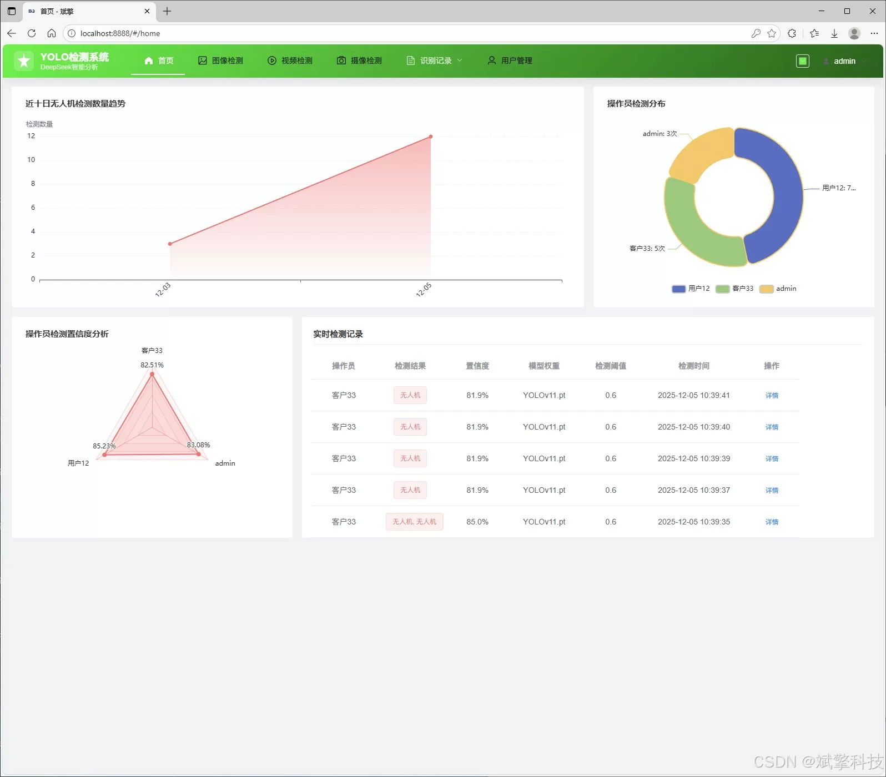
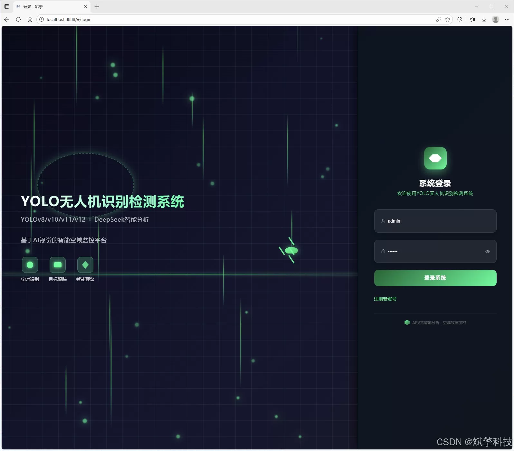
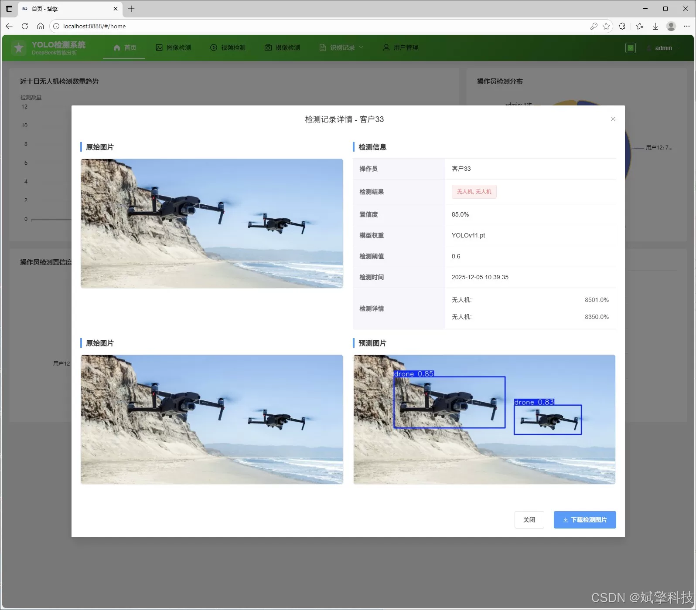
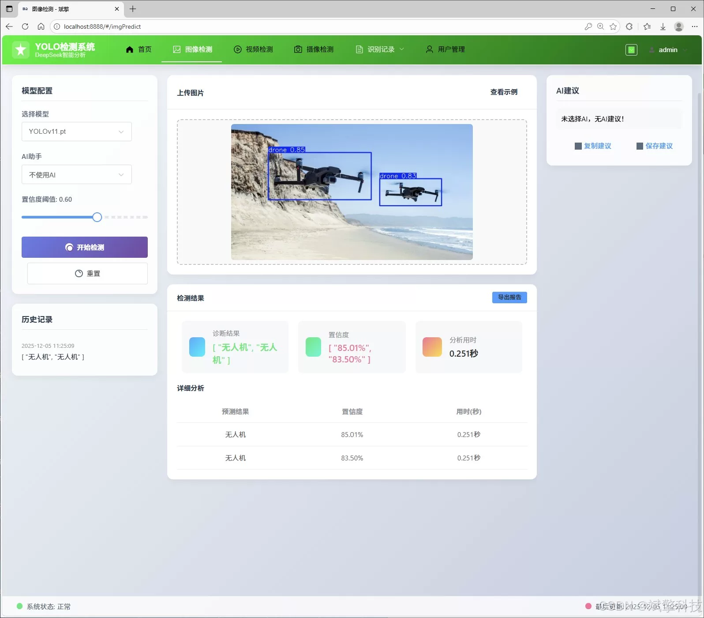
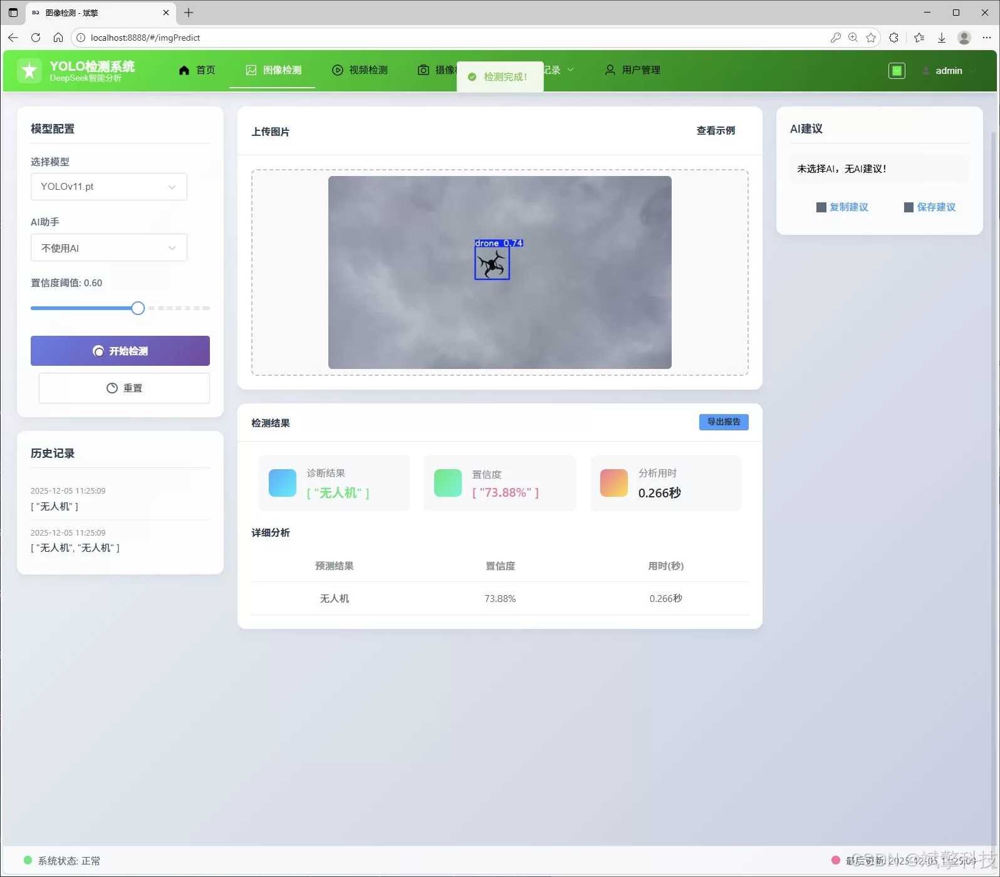
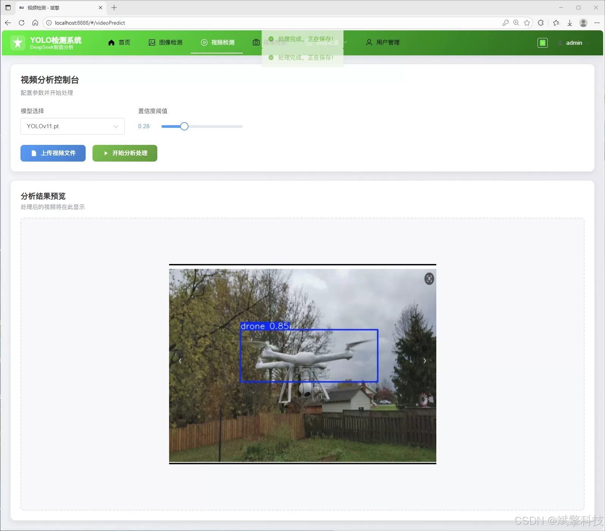
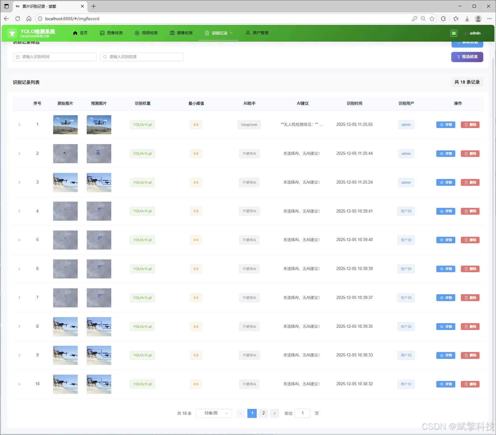
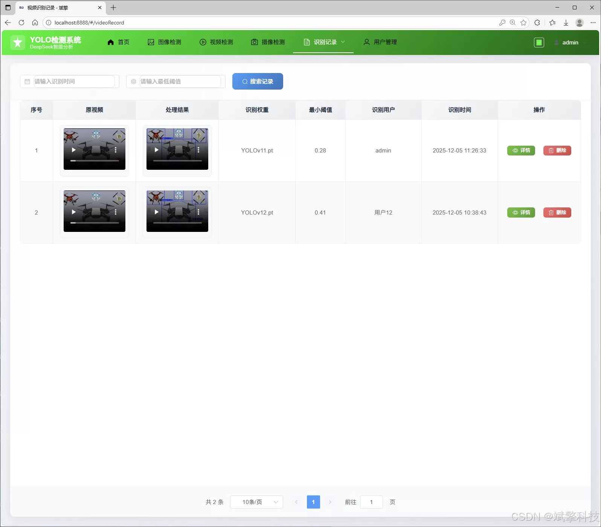
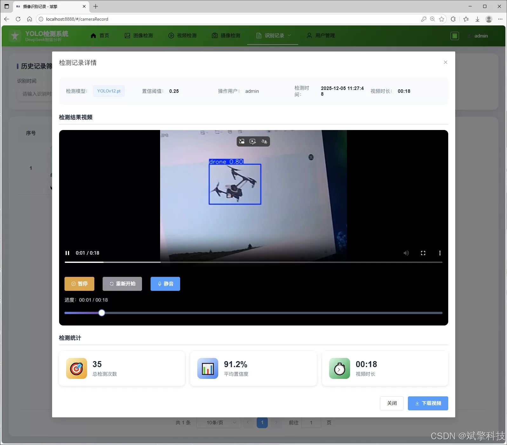

# YOLO+Large Model Drone Detection System

## Body

YOLO+Large Model Drone Detection System Based on YOLO Deep Learning and the Large Models of Qianwen, DeepSeek, etc. (DeepSeek Intelligent Analysis + Web Interaction Interface + Front-end-Back-end Separation + YOLO Data + YOLOv8/YOLOv10/YOLOv11/YOLOv12)

The project aims to design and implement an efficient, accurate, and user-friendly drone automatic recognition and comprehensive management system. The core of the system adopts the current most cutting-edge YOLOv8/YOLOv10/YOLOv11/YOLOv12 object detection algorithms, building a high-performance drone detection model. The project innovatively integrates the intelligent analysis capabilities of the DeepSeek large language model, endowing the system with semantic understanding and generational description functions for detection results. The system architecture adopts a modern design pattern of front-end and back-end separation, using Spring Boot and other frameworks to build robust API services in the back-end, while the front-end is constructed with Vue.js to create responsive and highly interactive Web interfaces, ensuring good maintainability and extensibility. The system has comprehensive functions, not only supporting real-time image, video, and camera stream detection of drones but also persistently storing all detection records and user behavior data into MySQL databases, and providing a complete set of back-end modules such as user permission management, visualization data analysis, and multimedia record management. This system combines cutting-edge deep learning technology, large model intelligent analysis, and mature software engineering practices, providing a powerful and intuitive integrated solution for drone supervision, airspace safety, countermeasure systems, and other fields.

Functional modules
✅ Information visualization, data visualization.
✅ AI analysis support for image detection through deepseek and Qianwen.
✅ Support for image detection, video detection, and real-time camera detection, with detection results saved to MySQL database.
✅ Image recognition record management, video recognition record management, and camera recognition record management.
✅ User management module, allowing administrators to add, delete, update, and view users.
✅ Personal center, where users can modify their information, including passwords, names, and profile pictures.

## Images

## Payment

Here is a pay link on Stripe ( https://buy.stripe.com/3cs8yP7sY87d0vu9AB ). Please contact me lonlonago@foxmail.com after funding $89, and I will send you a complete data files , thank you!

